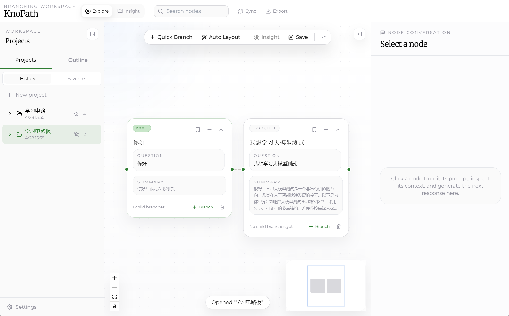
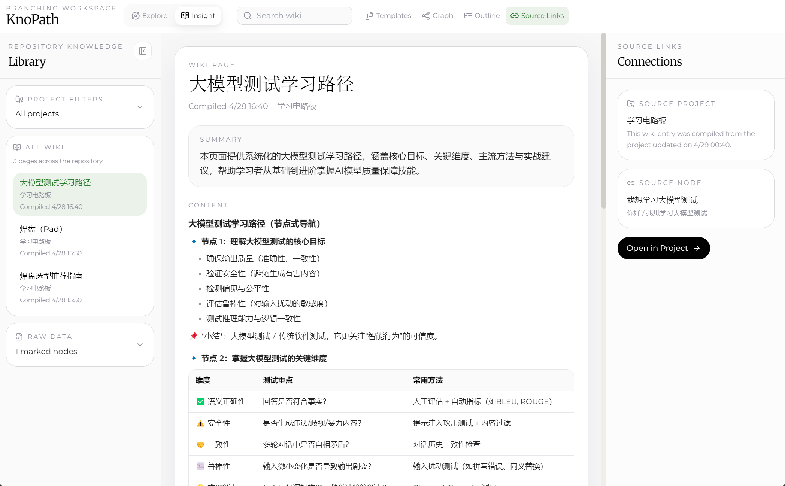
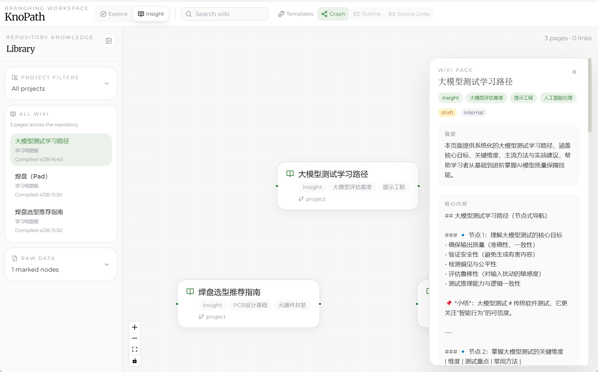
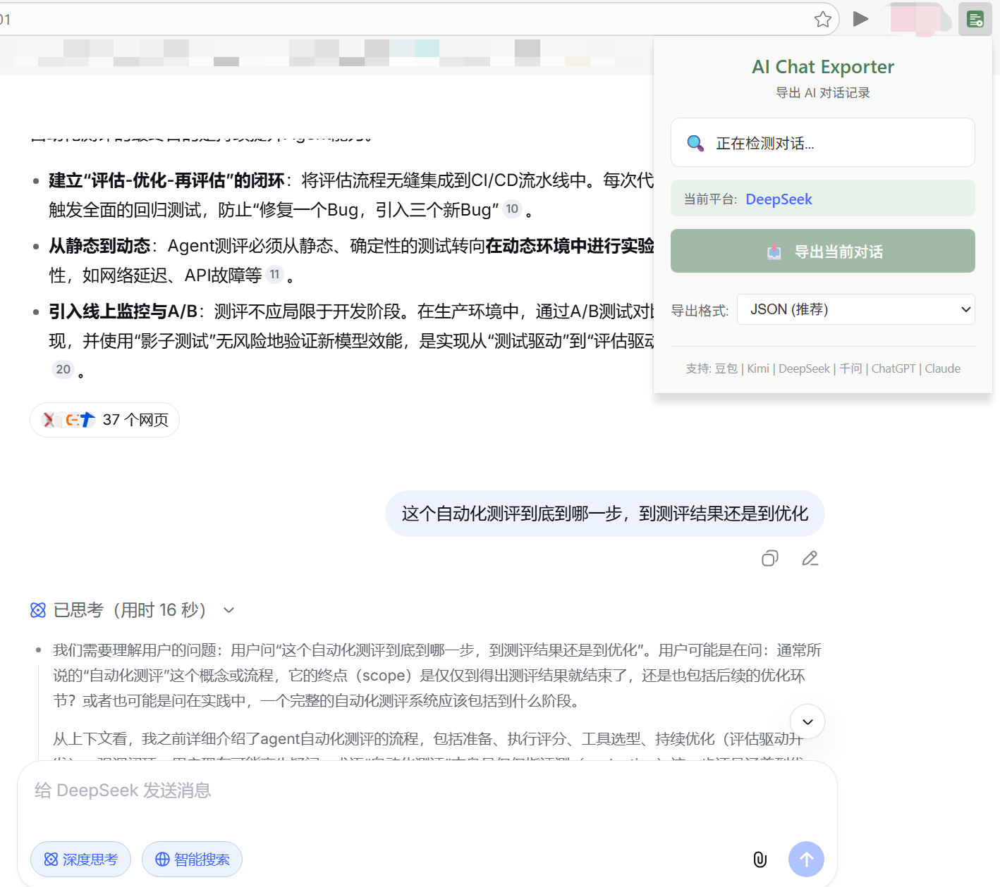

<div align="center">

# KnoPath

**分支式 AI 知识探索与沉淀工具**

将线性对话转化为可导航、可回看、可导出的知识地图

[](LICENSE)
[]()

[English](#english) | [中文](#中文)

</div>

---

## 中文

### KnoPath 是什么？

当你用 ChatGPT 探索一个复杂问题时，对话很快变得冗长混乱——你无法回看、无法对比、无法沉淀。

KnoPath 让你围绕任意节点**分支探索**，自动继承上下文，最终一键编译成结构化的**知识库**。

```
传统对话:  Q → A → Q → A → Q → A → ...（线性、不可回溯）

KnoPath:       ┌─ 追问细节 → A
      Q → A ──┼─ 对比方案 → A    →  一键编译 → Wiki 知识库
               └─ 验证反例 → A
```

### 功能截图

#### Explore 视图 — 分支式知识探索



#### Insight 视图 — 标记、编译、沉淀



#### Wiki Graph — 知识关系图谱



#### 浏览器插件 — 一键导出 AI 对话



### 核心功能

| 功能 | 说明 |
|------|------|
| 🌳 分支探索 | 围绕任意节点继续追问、对比、验证反例 |
| 🔄 上下文继承 | 新分支自动继承祖先摘要和关键结论 |
| 📚 一键编译 | 标记关键节点 → Insight 编译 → 生成 Wiki 知识库 |
| 🕸️ 知识图谱 | Wiki 页面关系可视化，发现知识间的隐含联系 |
| 💾 本地优先 | 所有数据存储在本地，支持 Obsidian 等工具打开 |
| 📂 JSON 导入 | 上传对话记录，快速创建项目 |
| 📤 多格式导出 | Markdown 大纲、PNG 画布导出 |
| 🔌 浏览器插件 | 支持 DeepSeek、豆包、Kimi、千问等平台一键导出 |

### 快速开始

#### 方式一：下载安装包（推荐）

1. 前往 [Releases](https://github.com/your-username/knopath/releases) 下载最新版安装包
2. 运行安装程序
3. 启动 KnoPath，在 Settings 中配置 API Key

> 安装包内置 Python 运行时，无需额外安装任何环境。

#### 方式二：从源码运行

**环境要求**: Node.js >= 18, Python >= 3.9

```bash
# 克隆仓库
git clone https://github.com/your-username/knopath.git
cd knopath

# 安装前端依赖
cd front && npm install

# 安装后端依赖
cd ../app && pip install -r requirements.txt

# 启动应用
cd ../front && npm start
```

#### 配置模型

1. 点击左下角 **Settings** 图标
2. 填写 API 配置：
   - **Model**: 选择模型（如 gpt-4o-mini）
   - **API Key**: 填写你的 API Key
   - **Base URL**: API 端点（默认 OpenAI，也支持兼容接口）
3. 点击保存

未配置 API Key 时，应用会使用 Mock 模式进行测试。

### 浏览器插件

支持从 DeepSeek、豆包、Kimi、千问、ChatGPT、Claude 等平台一键导出对话，包括对话分支。

#### 安装方法

1. 打开 Chrome/Edge 浏览器，访问 `chrome://extensions/`
2. 开启右上角「开发者模式」
3. 将 `browser-extension` 文件夹拖入页面，或点击「加载已解压的扩展程序」选择该文件夹
4. 在 AI 对话页面点击插件图标即可导出

#### 支持平台

| 平台 | 网址 | 分支支持 |
|------|------|----------|
| DeepSeek | chat.deepseek.com | ✅ 支持 |
| 豆包 | doubao.com | ✅ |
| Kimi | kimi.moonshot.cn | ✅ |
| 千问 | chat.qwen.ai, qianwen.com | ✅ |
| ChatGPT | chatgpt.com | ✅ |
| Claude | claude.ai | ✅ |

#### 支持格式

- **KnoPath JSON**: 直接导入 KnoPath，支持分支
- **Chat Export**: 通用对话格式
- **Markdown**: 纯文本格式
- **Plain Text**: 简单文本

### 使用流程

```
1. 创建项目        →  输入你的探索主题
2. 分支探索        →  围绕节点追问、对比、验证
3. 标记 Insight    →  选择有价值的节点标记
4. 编译 Wiki       →  一键生成结构化知识库
5. 知识图谱        →  可视化知识间的关系
6. 导出使用        →  用 Obsidian 等工具打开本地仓库
```

### 从源码构建安装包

```bash
# 1. 准备 Python Embedded 运行时
python scripts/build.py

# 2. 构建安装包
cd front
npm run build

# 安装包输出在 front/release/
```

### 技术栈

| 层 | 技术 |
|----|------|
| 前端 | React 18 + TypeScript + Vite + React Flow + Zustand + TailwindCSS |
| 后端 | FastAPI + SQLite + SQLAlchemy + Jinja2 |
| 桌面 | Electron |
| 文件同步 | Watchdog + WebSocket |

### 项目结构

```
knopath/
├── front/                 # Electron + React 前端
│   ├── src/components/    # UI 组件
│   ├── src/lib/           # 工具函数与 API
│   ├── src/store/         # Zustand 状态管理
│   ├── electron.cjs       # Electron 主进程
│   └── preload.cjs        # 预加载脚本
├── app/                   # FastAPI 后端
│   ├── routes/            # API 路由
│   ├── services/          # 业务逻辑
│   ├── prompt/            # LLM 提示词模板
│   └── requirements.txt
├── browser-extension/     # 浏览器插件
│   ├── manifest.json      # 插件配置
│   ├── popup.html         # 弹出界面
│   ├── popup.js           # 主逻辑
│   └── content/           # 各平台内容脚本
├── scripts/               # 构建脚本
│   └── build.py           # Python Embed 打包脚本
└── assets/                # 截图与资源
```

### 贡献

欢迎贡献！请阅读 [贡献指南](CONTRIBUTING.md) 了解详情。

### License

[MIT License](LICENSE)

---

## English

### What is KnoPath?

When you explore a complex topic with ChatGPT, the conversation quickly becomes long and messy — you can't look back, compare, or crystallize.

KnoPath lets you **branch from any node** to explore further, automatically inherits context, and compiles everything into a structured **knowledge base** with one click.

```
Traditional:  Q → A → Q → A → Q → A → ... (linear, no backtracking)

KnoPath:       ┌─ Follow-up → A
      Q → A ──┼─ Compare   → A    →  One-click compile → Wiki knowledge base
               └─ Verify    → A
```

### Screenshots

#### Explore View — Branching Knowledge Exploration


#### Insight View — Mark, Compile, Crystallize


#### Wiki Graph — Knowledge Relationship Graph


#### Browser Extension — One-Click Export AI Conversations


### Key Features

| Feature | Description |
|---------|-------------|
| 🌳 Branching Exploration | Branch from any node to ask follow-ups, compare alternatives, or verify counter-examples |
| 🔄 Context Inheritance | New branches automatically inherit ancestor summaries and key conclusions |
| 📚 One-Click Compilation | Mark insights → Compile → Generate Wiki knowledge base |
| 🕸️ Knowledge Graph | Visualize relationships between Wiki pages |
| 💾 Local-First | All data stored locally, compatible with Obsidian |
| 📂 JSON Import | Upload chat history to quickly create projects |
| 📤 Multi-format Export | Markdown outline, PNG canvas export |
| 🔌 Browser Extension | One-click export from DeepSeek, Doubao, Kimi, Qianwen, etc. |

### Quick Start

#### Option 1: Download Installer (Recommended)

1. Download the latest release from [Releases](https://github.com/your-username/knopath/releases)
2. Run the installer
3. Launch KnoPath and configure your API Key in Settings

> The installer includes a bundled Python runtime — no additional environment needed.

#### Option 2: Run from Source

**Prerequisites**: Node.js >= 18, Python >= 3.9

```bash
git clone https://github.com/your-username/knopath.git
cd knopath

# Install dependencies
cd front && npm install
cd ../app && pip install -r requirements.txt

# Start the application
cd ../front && npm start
```

### Browser Extension

Export conversations from DeepSeek, Doubao, Kimi, Qianwen, ChatGPT, Claude with one click, including conversation branches.

#### Installation

1. Open Chrome/Edge and go to `chrome://extensions/`
2. Enable "Developer mode" in the top right
3. Drag the `browser-extension` folder into the page, or click "Load unpacked" to select it
4. Click the extension icon on any AI chat page to export

#### Supported Platforms

| Platform | URL | Branch Support |
|----------|-----|----------------|
| DeepSeek | chat.deepseek.com | ✅ Full support |
| Doubao | doubao.com | ✅ |
| Kimi | kimi.moonshot.cn | ✅ |
| Qianwen | chat.qwen.ai, qianwen.com | ✅ |
| ChatGPT | chatgpt.com | ✅ |
| Claude | claude.ai | ✅ |

#### Export Formats

- **KnoPath JSON**: Import directly into KnoPath, with branch support
- **Chat Export**: Universal chat format
- **Markdown**: Plain text format
- **Plain Text**: Simple text

### Build from Source

```bash
# 1. Prepare Python Embedded runtime
python scripts/build.py

# 2. Build installer
cd front && npm run build

# Output: front/release/
```

### Tech Stack

| Layer | Technology |
|-------|-----------|
| Frontend | React 18 + TypeScript + Vite + React Flow + Zustand + TailwindCSS |
| Backend | FastAPI + SQLite + SQLAlchemy + Jinja2 |
| Desktop | Electron |
| File Sync | Watchdog + WebSocket |

### Project Structure

```
knopath/
├── front/                 # Electron + React frontend
│   ├── src/components/    # UI components
│   ├── src/lib/           # Utilities & API
│   ├── src/store/         # Zustand state management
│   ├── electron.cjs       # Electron main process
│   └── preload.cjs        # Preload script
├── app/                   # FastAPI backend
│   ├── routes/            # API routes
│   ├── services/          # Business logic
│   ├── prompt/            # LLM prompt templates
│   └── requirements.txt
├── browser-extension/     # Browser extension
│   ├── manifest.json      # Extension config
│   ├── popup.html         # Popup UI
│   ├── popup.js           # Main logic
│   └── content/           # Platform content scripts
├── scripts/               # Build scripts
│   └── build.py           # Python Embed packaging script
└── assets/                # Screenshots & resources
```

### License

[MIT License](LICENSE)
